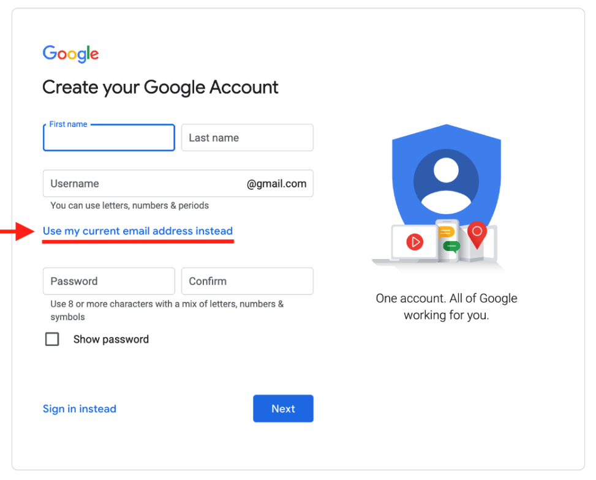

# Troubleshooting

## Creating a shadow Google identity

Note: If you encounter any problems after creating a shadow Google identity please contact helpdesk@greensoftware.foundation.

* Go to the [Google Account Sign In](https://accounts.google.com/signin) page.
* Click Create account.
* Enter your name.
* Click **Use my current email address instead**.

* Enter your current email address.
* Click Next.
* Verify your email address with the code sent to your existing email.
* Click Verify.
